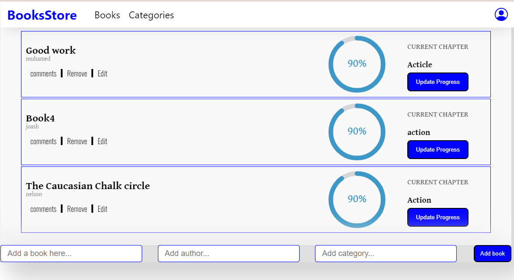

# BOOKSTORE

This is an application that is used to handle simple BOOKSTORE

## Languages

- React
- Redux


## Live Demo
- [live demo](https://mybookstore345.herokuapp.com/)

## Screenshot


## **Setup**   
To use this project copy the code SSl link othe repository<br />
## React installation process
- Step 1 - Create the Root Folder. ...
- Step 2 - install React and react dom. ...
- Step 3 - Install webpack. ...
- Step 4 - Install babel. ...
- Step 5 - Create the Files. ...
- Step 6 - Set Compiler, Server and Loaders. ...
- Step 7 - index. ...
- Step 8 − App.

## In the terminal

```bash
  npx create-react-app my-app
```
``` bash
 cd my-app
```
Run  
```bash
  npm start
```

## Josphat Kiploman

- [@Github](https://github.com/Josphat205)

- [@Linkedin](https://www.linkedin.com/in/josphat-kiploman-797430236/)

## **Usage**
You can use the project for learning, know how codes are arranged in Html , javascript and Css

## **Deployment**
1. Go to setting on your github repo
2. go to pages
3. Deploy pages
4. change the branch to main and save

## 🤝 Contributing

Contributions, issues, and feature requests are welcome!

## Show your support

Give a ⭐ if you like this project!

## 📝 License

This project is [MIT](./MIT.md) licensed.
